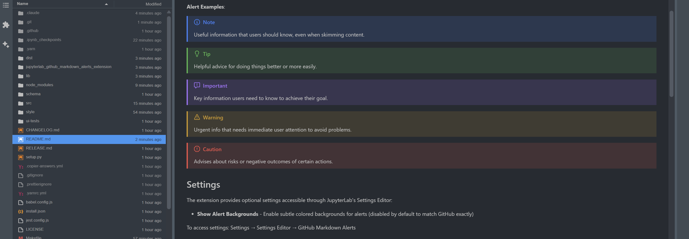

# JupyterLab GitHub Markdown Alerts Extension

[](https://github.com/stellarshenson/jupyterlab_github_markdown_alerts_extension/actions/workflows/build.yml)
[](https://www.npmjs.com/package/jupyterlab_github_markdown_alerts_extension)
[](https://pypi.org/project/jupyterlab-github-markdown-alerts-extension/)
[](https://pepy.tech/project/jupyterlab-github-markdown-alerts-extension)
[](https://jupyterlab.readthedocs.io/en/stable/)

A JupyterLab 4 extension that renders GitHub-style alert blocks in Markdown cells, providing visual emphasis for notes, tips, warnings, and other important information.

This extension brings GitHub's alert syntax to JupyterLab, allowing you to create styled callout blocks using simple markdown notation. Alerts automatically adapt to light and dark themes, matching GitHub's visual design.



**Key Features**:
- Five alert types - NOTE, TIP, IMPORTANT, WARNING, CAUTION
- Automatic theme adaptation - colors adjust for light and dark modes
- GitHub-compatible syntax - works with standard GitHub markdown alert notation
- Icon integration - each alert type displays with its corresponding icon
- Zero configuration - works immediately after installation

## Requirements

- JupyterLab >= 4.0.0

## Usage

Create alert blocks in markdown cells using GitHub's alert syntax. Start with a blockquote containing the alert type, followed by content lines:

```
> [!NOTE]
> Useful information that users should know, even when skimming content.

> [!TIP]
> Helpful advice for doing things better or more easily.

> [!IMPORTANT]
> Key information users need to know to achieve their goal.

> [!WARNING]
> Urgent info that needs immediate user attention to avoid problems.

> [!CAUTION]
> Advises about risks or negative outcomes of certain actions.
```

Each alert type renders with distinct colors and icons matching GitHub's design. Multi-line content is supported by continuing the blockquote format.

**Alert Examples**:

> [!NOTE]
> Useful information that users should know, even when skimming content.

> [!TIP]
> Helpful advice for doing things better or more easily.

> [!IMPORTANT]
> Key information users need to know to achieve their goal.

> [!WARNING]
> Urgent info that needs immediate user attention to avoid problems.

> [!CAUTION]
> Advises about risks or negative outcomes of certain actions.

## Settings

The extension provides optional settings accessible through JupyterLab's Settings Editor:

- **Show Alert Backgrounds** - Enable subtle colored backgrounds for alerts (disabled by default to match GitHub exactly)

To access settings: Settings → Settings Editor → GitHub Markdown Alerts

## Install

```bash
pip install jupyterlab_github_markdown_alerts_extension
```

## Uninstall

```bash
pip uninstall jupyterlab_github_markdown_alerts_extension
```

## Contributing

### Development install

Note: You will need NodeJS to build the extension package.

The `jlpm` command is JupyterLab's pinned version of
[yarn](https://yarnpkg.com/) that is installed with JupyterLab. You may use
`yarn` or `npm` in lieu of `jlpm` below.

```bash
# Clone the repo to your local environment
# Change directory to the jupyterlab_github_markdown_alerts_extension directory

# Set up a virtual environment and install package in development mode
python -m venv .venv
source .venv/bin/activate
pip install --editable "."

# Link your development version of the extension with JupyterLab
jupyter labextension develop . --overwrite

# Rebuild extension Typescript source after making changes
# IMPORTANT: Unlike the steps above which are performed only once, do this step
# every time you make a change.
jlpm build
```

You can watch the source directory and run JupyterLab at the same time in different terminals to watch for changes in the extension's source and automatically rebuild the extension.

```bash
# Watch the source directory in one terminal, automatically rebuilding when needed
jlpm watch
# Run JupyterLab in another terminal
jupyter lab
```

With the watch command running, every saved change will immediately be built locally and available in your running JupyterLab. Refresh JupyterLab to load the change in your browser (you may need to wait several seconds for the extension to be rebuilt).

By default, the `jlpm build` command generates the source maps for this extension to make it easier to debug using the browser dev tools. To also generate source maps for the JupyterLab core extensions, you can run the following command:

```bash
jupyter lab build --minimize=False
```

### Development uninstall

```bash
pip uninstall jupyterlab_github_markdown_alerts_extension
```

In development mode, you will also need to remove the symlink created by `jupyter labextension develop`
command. To find its location, you can run `jupyter labextension list` to figure out where the `labextensions`
folder is located. Then you can remove the symlink named `jupyterlab_github_markdown_alerts_extension` within that folder.

### Testing the extension

#### Frontend tests

This extension is using [Jest](https://jestjs.io/) for JavaScript code testing.

To execute them, execute:

```sh
jlpm
jlpm test
```

#### Integration tests

This extension uses [Playwright](https://playwright.dev/docs/intro) for the integration tests (aka user level tests).
More precisely, the JupyterLab helper [Galata](https://github.com/jupyterlab/jupyterlab/tree/master/galata) is used to handle testing the extension in JupyterLab.

More information are provided within the [ui-tests](./ui-tests/README.md) README.

### Packaging the extension

See [RELEASE](RELEASE.md)
