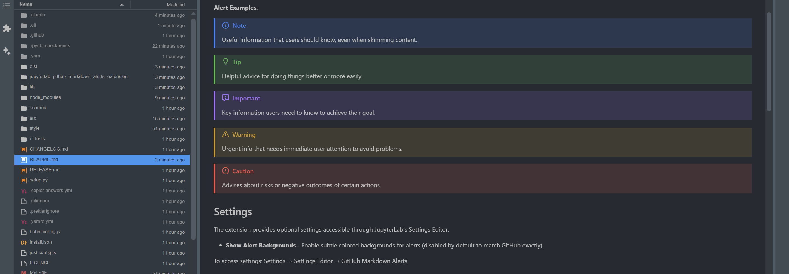

# JupyterLab GitHub Markdown Alerts Extension

[](https://github.com/stellarshenson/jupyterlab_github_markdown_alerts_extension/actions/workflows/build.yml)
[](https://www.npmjs.com/package/jupyterlab_github_markdown_alerts_extension)
[](https://pypi.org/project/jupyterlab-github-markdown-alerts-extension/)
[](https://pepy.tech/project/jupyterlab-github-markdown-alerts-extension)
[](https://jupyterlab.readthedocs.io/en/stable/)

> [!TIP]
> This extension is part of the [stellars_jupyterlab_extensions](https://github.com/stellarshenson/stellars_jupyterlab_extensions) metapackage. Install all Stellars extensions at once: `pip install stellars_jupyterlab_extensions`

A JupyterLab 4 extension that renders GitHub-style alert blocks in Markdown cells, providing visual emphasis for notes, tips, warnings, and other important information.

This extension brings GitHub's alert syntax to JupyterLab, allowing you to create styled callout blocks using simple markdown notation. Alerts automatically adapt to light and dark themes, matching GitHub's visual design.



**Key Features**:

- Five alert types - NOTE, TIP, IMPORTANT, WARNING, CAUTION
- Automatic theme adaptation - colors adjust for light and dark modes
- GitHub-compatible syntax - works with standard GitHub markdown alert notation
- Icon integration - each alert type displays with its corresponding icon
- Zero configuration - works immediately after installation

## Requirements

- JupyterLab >= 4.0.0

## Usage

Create alert blocks in markdown cells using GitHub's alert syntax. Start with a blockquote containing the alert type, followed by content lines:

```
> [!NOTE]
> Useful information that users should know, even when skimming content.

> [!TIP]
> Helpful advice for doing things better or more easily.

> [!IMPORTANT]
> Key information users need to know to achieve their goal.

> [!WARNING]
> Urgent info that needs immediate user attention to avoid problems.

> [!CAUTION]
> Advises about risks or negative outcomes of certain actions.
```

Each alert type renders with distinct colors and icons matching GitHub's design. Multi-line content is supported by continuing the blockquote format.

**Alert Examples**:

> [!NOTE]
> Useful information that users should know, even when skimming content.

> [!TIP]
> Helpful advice for doing things better or more easily.

> [!IMPORTANT]
> Key information users need to know to achieve their goal.

> [!WARNING]
> Urgent info that needs immediate user attention to avoid problems.

> [!CAUTION]
> Advises about risks or negative outcomes of certain actions.

## Settings

The extension provides optional settings accessible through JupyterLab's Settings Editor:

- **Show Alert Backgrounds** - Enable subtle colored backgrounds for alerts (disabled by default to match GitHub exactly)

To access settings: Settings → Settings Editor → GitHub Markdown Alerts

## Install

```bash
pip install jupyterlab_github_markdown_alerts_extension
```

## Uninstall

```bash
pip uninstall jupyterlab_github_markdown_alerts_extension
```

## Contributing

If you would like to contribute to this extension, please refer to the [Contributing Guide](CONTRIBUTING.md).
